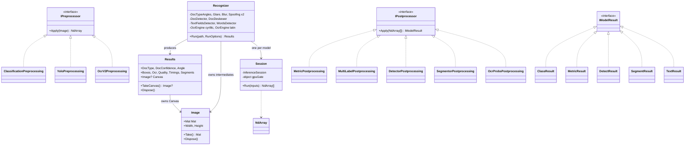

# ports/dotnet — how this implementation works

This document is for two readers: someone integrating the library who wants to know what they
are getting, and a maintainer (or another AI assistant) arriving at the code without the history
of the port.

It deliberately does **not** duplicate the three normative documents:

| Document | Answers |
|---|---|
| [`../CONVENTIONS.md`](../CONVENTIONS.md) | *how* a port is written — shared by all four |
| [`../MAPPING.md`](../MAPPING.md) | *which Python file corresponds to what*, per language |
| [`DEVIATIONS.md`](DEVIATIONS.md) | *where this port legitimately differs*, numbered |
| **this file** | *how this .NET implementation actually works* |

Conformance status: **PASS on 44/44 stages across all seven cases, zero skips**, on both the
`cpu` and `gpu` profiles. Two stages pass under relaxation R-02 (`borders.canvas` and
`deskew.canvas`) — `warpPerspective` interpolation differs by at most one grey level on 0.02% of
pixels between OpenCV minors, which is documented, measured, and not a defect.

---

## 1. The two assemblies, and why the boundary is enforced

```
RussianDocs.DocumentProcessing.dll     the library — port of document_processing/
RussianDocs.Service.dll                the service — port of service/
RussianDocs.Conform.exe                the conformance CLI
```

`RussianDocs.DocumentProcessing` has **no reference to the service**, and that is a compile-time
fact rather than a convention. It is rule 10 of `service/ml/runtime.py` ("only this module
imports the library") turned into something a build can check: the service is testable without
215 MB of models, which is what makes the 23 contract tests run in 200 ms.

The service reaches the library through exactly one type, `Ml/PipelineRuntime`. Nothing else
under `RussianDocs.Service` references `RussianDocs.DocumentProcessing.Pipeline`.

```
src/RussianDocs.DocumentProcessing/
  Tensors/       NdArray, Npy, Npz, PyNum, Ops        .npy/.npz I/O and CPython numerics
  Imaging/       Image, Io, Crop, FloatMask,          the only namespace that touches OpenCV
                 Contours, Geometry
  Config/        ModelPaths, Alphabets                models_path.yaml, ocr_alphabets.json
  Inference/     Session, DeviceResolution            ONNX Runtime, device selection
  Models/        ModelJson, Loader,                   the three dispatch switches
                 DetectionModel, SegmentationModel
  Preprocess/    Preprocess, Yolo, OcrV2              input pipelines, by declared Type
  Postprocess/   Postprocess, Detector, Segmentor,    output pipelines, by declared Type
                 OcrProbs
  Modules/       DocTypeAngles, Quality, Glare,       one per pipeline_modules/ subdirectory
                 Blur, Spoofing, DocDetector,
                 Deskewer, TextFieldsDetector,
                 WordsDetector, OcrEngine,
                 OcrCorrections
  Pipeline/      Recognizer, Results, StageSink,      the orchestrator
                 Parallel, OcrOptions, SplitWords,
                 Ocr, Timings
  ViewModel/     Labels, Payload, Builder             the wire contract

src/RussianDocs.Service/
  Config/        Settings                             environment tier
  Model/         Document, ApiKey                     the record format AND future SQL columns
  Store/         IDocumentStore, FileStore            the SQL swap point
  Repositories/  Documents, ApiKeys, Artifacts,       the migration contract
                 SettingsRepository
  Settings/      SettingsSchema                       server-owned, UI renders itself from it
  Auth/          Tokens                               PIN → JWT, API keys
  Logging/       LogRing, RingLoggerProvider          two sinks, one buffer
  Ml/            PipelineRuntime                      **the deliverable**
  Worker/        RecognitionWorker, SearchText        the drain loop
  Api/           ApiErrors, Identity, SysInfo,        the HTTP surface
                 ApiServer{,.Documents,.Misc}
  Seed/          SeedData                             pre-computed samples
  Program.cs                                          startup order
```

`ViewModel` sits on the **library** side even though Python puts it in `service/ml/transform.py`
(D-01): the conformance CLI needs it and must not depend on an HTTP service.

---

## 2. Types and ownership



Two things in that diagram are load-bearing:

**`IModelResult` is a closed set with exactly one cast site.** A postprocessor returns one of
five result types, and the *module* — which knows what it asked for — performs the single cast.
The alternative, a generic `Model<T>`, cannot work: the concrete type is unknown until
`model.json` is read, so every language would arrive at a runtime cast anyway.

**No inheritance for behaviour.** Python's two real inheritance cases are unrolled:
`OBBPreprocessing` gets its own type that *calls* the shared letterbox, and
`PerClassYOLODetectorPostprocessing` is folded into one type with an explicit `NmsMode` field.
Unrolling is cheaper than explaining virtual dispatch three more times.

---

## 3. One recognition, end to end

```mermaid
sequenceDiagram
    participant C as caller
    participant R as Recognizer
    participant D as DocTypeAngles
    participant Q as quality group
    participant B as DocDetector
    participant K as DocDeskewer
    participant T as TextFieldsDetector
    participant W as WordsDetector
    participant O as OcrEngine

    C->>R: Run(path, options)
    R->>R: decode → RGB, shrink to img_size    [stage: prepare]
    R->>D: classify
    D-->>R: doc_type, DocConf, angle
    alt doc_type == "NONE" or DocConf < docconf
        R-->>C: Results with DocType="NONE"    (NOT an error)
    end
    R->>R: rotate by 90k                       [stage: rotate]
    R->>Q: Glare, Blur, PrintSpoofing, LcdSpoofing
    Note over Q: concurrent only when low_quality;<br/>otherwise sequential, because the<br/>verdict decides whether borders run
    Q-->>R: verdicts                           [stage: quality]
    R->>B: segment the document
    B-->>R: contours → quad → warp             [stages: borders.segments, borders.canvas]
    R->>K: projection-profile angle scan
    K-->>R: canvas                             [stage: deskew.canvas]
    R->>T: detect text fields
    T-->>R: boxes                              [stage: fields.bbox]
    loop per field needing a split
        R->>W: detect words
        W-->>R: word boxes                     [stage: words.<Field>.bbox]
    end
    loop per word
        R->>O: cyrillic or latin, by field and parity
        O-->>R: text                           [stage: ocr.<Field>.words]
    end
    R->>R: join, dedup, fix                    [stage: join]
    R-->>C: Results
```

Branch points a reader should know about:

- **`doc_type == "NONE"` is a normal short return, not an error.** Throwing here would break the
  "document not recognised" path the SPA renders as a legitimate state.
- **The quality group is conditionally concurrent.** With `low_quality = false` — the default —
  it runs sequentially, because the verdict must be known before deciding whether to run border
  detection at all.
- **SNILS routes words by index parity, not field semantics.** Odd-indexed words go to the
  Cyrillic engine even inside a date field, because a SNILS date reads "26 СЕНТЯБРЯ 1997". The
  rule is in the reference and load-bearing; the conformance suite would catch its removal.
- **`intpassportaddr` must be tested before `intpassport`** in the options dispatch. Substring
  order is correctness here, not style.
- **The address path is declared and not implemented.** `INTPASSPORTADDR` needs OBB-NMS and
  Sutherland–Hodgman polygon clipping, and — the actual blocker — an *anonymised* sample, which
  does not exist. The types are present so the shape is visible; see §8.

---

## 4. Concurrency: six mechanisms, each with a measurement behind it

| Mechanism | Where | Why this one |
|---|---|---|
| `Task.WhenAll` over a fixed array | `Pipeline/Parallel.cs` | Structured fan-out/join over a *known* set. Results collected **positionally**, never appended from a callback — Python's `futures[i].result()` is positional and deterministic, and a collect-as-they-finish version reorders boxes, words and joined field text under load. That is an exact-match failure with no float involved. |
| `lock` around `Session.Run`, GPU only | `Inference/Session.cs` | Eight threads on one CUDA session degraded the Go port by 90× and wedged Python with `cudaErrorIllegalAddress`. Held around `Run` **only**, so five different models keep their parallelism. CPU sessions take no lock, deliberately. |
| `SemaphoreSlim` + `ConcurrentBag` as a lease pool | `Ml/PipelineRuntime.cs` | The lease needs a **timeout**, which a monitor cannot express. Size 1 because a second instance is a second CUDA context. Exposed only as `Use<T>()`, so "transform before releasing" is structural. |
| One long-running drain task | `Worker/RecognitionWorker.cs` | The concurrency bound is structural rather than configured: one loop, so one document at a time, so the pool of one is never contended by the worker itself. |
| `SemaphoreSlim(0, 1)` as a wake flag | `Worker/RecognitionWorker.cs` | A flag, not a queue: many uploads collapse into one wake-up and no producer can block on a busy loop. |
| `lock` around the store index | `Store/FileStore.cs` | Both the worker and the request handlers write. Long I/O — a 2 MB PNG — happens **outside** it; only the rename and the index update are inside. Every public method takes it **at most once**. |

The timeout in `ProcessDocument` is the sharpest edge in the whole port: **it cannot cancel work
already inside the library.** Synchronous native code has no kill. The job is marked failed and
the loop moves on; the lease is released when that task eventually finishes, so later jobs get a
*bounded* `PipelineBusy` and requeue instead of blocking. A genuinely hung ONNX call needs a
process restart, and the container's restart policy is the last line of defence.

---

## 5. Resource lifetime — where a passing port dies at document 500

Python's GC hid this completely. Every `Mat` is native memory, and .NET makes the problem
*subtler* than Go rather than easier: `Mat` has a finalizer, so a missed `Dispose` becomes
**delayed** rather than permanent — memory the GC reclaims at a moment of its choosing, which
looks like a leak, measures like a leak, and cannot be reasoned about.

Three rules:

1. **`using` on every intermediate `Image`.** `Recognizer.Run` holds its state in locals and
   disposes each one it replaces.
2. **`Results.TakeCanvas()`, never a field read.** The canvas must outlive the run; every other
   image must not. Reading the field and returning left the fully decoded original alive
   forever — measured in the Go port at 663 → 4018 MB across 230 documents, unbounded, with the
   conformance suite green throughout, because the CLI disposes its `Results` after one document.
3. **The reaper.** A timed-out recognition still produces a canvas that nothing is reading.
   `RecognitionWorker.Reap` is the only place that frees it.

Proven rather than argued — `rdocs-conform soak --rounds 4` over 122 documents in one process:

```
ready              rss=248 MB
round 1  122 docs  rss=968 MB
round 2  244 docs  rss=1011 MB
round 3  366 docs  rss=1011 MB
round 4  488 docs  rss=1012 MB
```

Per-document retention 5.90 → 3.13 → 2.08 → 1.57 MB. That shape is a **plateau**: the arena
fills once and is reused. A leak keeps the per-document figure roughly constant. RSS is read
from the OS, not from `GC.GetTotalMemory`, because Mats and ORT arenas are invisible to the
managed counters — the Go port had the identical trap with `runtime.MemStats`.

---

## 6. Errors, and what each means to a caller

| Kind | HTTP | Transient | Meaning |
|---|---|---|---|
| `PipelineBusy` | 503 | yes | No pipeline free within the lease timeout. Requeue. |
| `RuntimeNotReady` | 503 | yes | Models still loading, or failed to load. Requeue. |
| `ImageUnreadable` | 422 | **no** | The bytes do not decode. Retrying is pointless. |
| `NotFound` | 404 | no | |
| `Unauthorized` | **401** | no | Not 403 — the SPA redirects to the PIN screen on 401 only. |
| `Conflict` | 409 | no | Well-formed, allowed, but the *state* forbids it. |
| `BadRequest` | 400 | no | |

Two decisions inside that table are worth naming. **An unknown error counts as
non-transient** — retried forever it stops the queue and leaves nothing in the log explaining
why. And **the message is separate from the kind**: the Go port shipped a defect where wrapping
put the sentinel's own name into the response, so a 409 read as `"conflict: The default key …"`.

`ErrorKind` is mapped to a status in exactly one place, `Api/ApiErrors.cs`, so no handler ever
picks a status code. That is what keeps 401-versus-403 and 409-versus-400 consistent across a
dozen endpoints.

---

## 7. Numeric fidelity — the traps that actually bit

Everything here is a *silent* exact-match failure. None of them can hide behind the 1e-3
tolerance, because each changes a discrete output.

| Trap | Where | Consequence if wrong |
|---|---|---|
| CPython float `//` is `fmod`-based, not `floor(x/y)` | `Tensors/PyNum.FloorDiv` | 2999×1777 gives width 1499, not 1500. A canvas one pixel wider shifts **every** box downstream. |
| `np.round` is half-to-even | `PyNum.RoundHalfEven` | A different integer box coordinate → a different crop → different text. |
| `np.argmax` returns the **first** maximum | `Tensors/Ops` | Strict `>` only. On a tie, a flipped CTC timestep changes a character. |
| Sorts must be **stable** | throughout | LINQ `OrderBy` is stable; `List.Sort` is an unstable introsort. Two equal-x word boxes swapping reorders two tokens in the joined field. |
| `np.lexsort((a, b))` sorts by **b** first | detector NMS | Argument order is the reverse of the intuition. |
| Python slices clamp; `Mat[Rect]` throws | `Imaging/Crop.ClampedCrop` | The **only** sanctioned crop path. A port that "works" is a port that clamps the way Python's slice effectively does. |
| float32 is never widened | `MathF.*` throughout | Accumulating in `double` "for accuracy" changes the result. |
| `cv2.convexHull` defaults to `clockwise: false` | `Imaging/Contours` | The binding makes it explicit, so the port *chooses*. Orientation decides which vertices Douglas–Peucker keeps → a different quad → a canvas 6 px narrower. |
| Two-pass variance | `Modules/Deskewer` | `E[x²] − E[x]²` loses ~7 digits at 255·W and flips the argmax between adjacent angles → a rotated image. |
| Invariant culture everywhere | wire formatting | A ru-RU host writes `0,904`. `InvariantGlobalization=true` makes it impossible; boundaries still pass `CultureInfo.InvariantCulture` explicitly, so a reader need not know that. |

Three more were found by *running* the service, not by reading:

- **A custom date format cannot hold nine fractional digits.** A `DateTime` tick is 100 ns, so
  seven `F`s is the maximum, and `T`/`Z` must be quoted or they are read as specifiers. Both
  throw. Symptom: every record failed to persist while the in-memory index looked fine.
- **Kestrel forbids synchronous body reads.** `ReadToEnd` throws, and a catch turned that into a
  400, so every PIN login reported a wrong PIN.
- **`HttpClient` proxies loopback.** On a machine behind a corporate proxy every test request
  left the box and returned HTML.

---

## 8. What is deliberately absent

| Not here | Why |
|---|---|
| `INTPASSPORTADDR` | Needs OBB-NMS and polygon clipping — and, the real blocker, an anonymised sample. Without one there is no golden, so it cannot be graded. The view-model types exist so the shape is visible. |
| `ocrGpuBatch = true` | A documented 5–14% field divergence in the reference. Porting it means re-measuring that from scratch. |
| OpenVINO / CoreML runtimes | `Session` leaves them addable; there are no implementations. |
| A SQL store | `IDocumentStore` is the swap point. Implementing it over a database and constructing that instead is the whole migration, as far as callers are concerned. |
| The FMS dictionary path | `_fix_fms` is a `return` in the reference: the `difflib` lookup is dead and the 1.6 MB CSV is parsed at import and never queried. The stub is ported with the reason attached. |
| Python's dead code | `OCRModel`, `OCRFVModel`, `ClassificationModel`, the commented `__load_*` block, the legacy 31×200 OCR path, `_deskew_two_page`, `gar_functions.py`, `warmup_ladder`. |

---

## 9. Consciously different from Python

| Python | Here | Why |
|---|---|---|
| `ThreadPoolExecutor` | `Task.WhenAll` over a fixed array | No GIL to work around; the array keeps collection positional. |
| `@contextmanager lease_pipeline()` | `Use<T>(timeout, body)` | Same guarantee, structurally enforced — there is no way to hold the result past the lambda. |
| Exceptions everywhere | Exceptions, with a 7-kind taxonomy | D-02: Go returns `(T, error)`, .NET and Kotlin throw. The taxonomy is what stays identical. |
| `match` falling through to `None` | `default:` throws, naming the unknown tag | D-06, a deliberate improvement: the reference turns a typo in `model.json` into a null dereference three stages later. |
| Unimplemented cases omitted | Wired, returning "not implemented" | An omitted case reads as an oversight and gets "helpfully" added differently in each port. |
| GC frees everything | `using` / `Dispose` on every `Mat` | See §5. |
| `print()` to stdout | `ILogger`, two sinks | The library printing to stdout would corrupt a JSON log stream. Not applicable here; stated so nobody re-adds it. |
| Reflection-driven config binding | A hand-written `Settings.Load` | Defaults stay next to the field they belong to, and the Go and Kotlin ports can read it line for line. |
| `python-jose`, `python-json-logger` | Hand-rolled JWT and log writer | The service adds **zero** dependencies beyond the two native libraries the library already needs. For a reference project somebody has to audit, that is worth forty lines. |

---

## 10. Running it

```bash
# build and test
cd ports/dotnet && dotnet build RussianDocs.sln -c Release && dotnet test RussianDocs.sln -c Release

# conformance, both profiles
python -m conformance.runner run --port dotnet
python -m conformance.runner run --port dotnet --profile gpu

# the leak check the conformance harness structurally cannot do
./src/RussianDocs.Conform/bin/Release/net8.0/rdocs-conform soak --rounds 4 --dir samples

# the service
DATA_DIR=/var/tmp/rdocs DEFAULT_API_KEY=rdk_dev JWT_SECRET=dev \
  ./src/RussianDocs.Service/bin/Release/net8.0/rdocs-service --addr :8004
```

`DATA_DIR` **must live outside the repository**: it holds uploaded documents, which are personal
data. `WARMUP_IMAGE` may only ever point at an anonymised `samples/` file — warmup re-reads it
at every start.

Docker, sizes and the traps found building them are in
[`build/Dockerfile`](build/Dockerfile)'s header.
