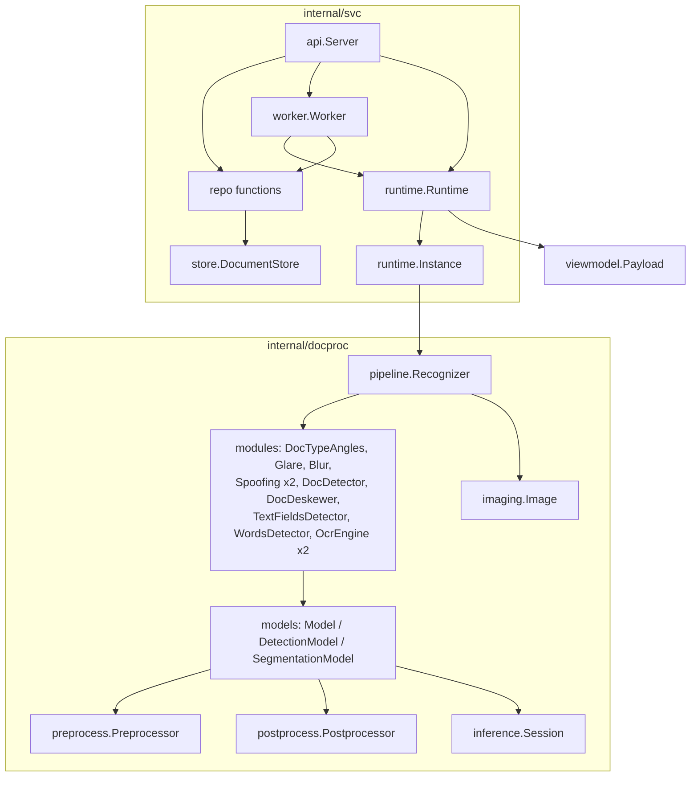
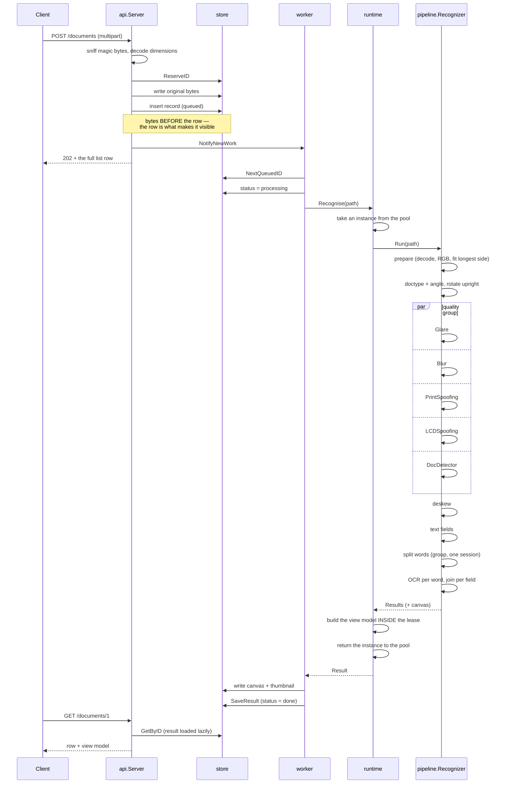

# The Go implementation

This document explains **how this Go implementation works**. It is written for two readers:
somebody integrating the library or the service into their own system, and a developer (or an
AI assistant) arriving at this code with no history of the discussions that shaped it.

It deliberately does **not** duplicate the other three documents in this directory:

| Document | Answers |
|---|---|
| [`CONVENTIONS.md`](../CONVENTIONS.md) | *How do I write a port?* — normative rules for Go, C#, Kotlin |
| [`MAPPING.md`](../MAPPING.md) | *Where does this Python file live in each port?* |
| [`DEVIATIONS.md`](DEVIATIONS.md) | *Where is a difference from Python legitimate?* — `D-01`…`D-13` |
| **this file** | *How does this implementation actually work?* |

The normative behaviour contract is elsewhere again: `conformance/spec/`. When this document
and the spec disagree, the spec wins and this file has a bug.

---

## 1. What is here

Two binaries from one module:

```
ports/go/
  cmd/
    rdocs-conform/     the conformance CLI: info, probe, recognize
    rdocs-service/     the HTTP service
  internal/
    docproc/           the LIBRARY  — port of document_processing/
      config/          models_path.yaml, ocr_alphabets.json
      imaging/         the only package that imports gocv
      tensor/          .npy, .npz, numeric helpers
      preprocess/      image -> tensor, per model.json Inputs[].Type
      postprocess/     tensor -> result, per model.json Outputs[].Type
      inference/       the only package that imports onnxruntime_go
      models/          model.json loading and the three dispatch switches
      modules/         one type per ML module
      pipeline/        the recognition sequence, timings, the stage probe
    viewmodel/         PipelineResults -> client JSON  (D-01: library side, not service)
    svc/               the SERVICE — port of service/
      config errs model store repo auth settingsschema
      logging runtime worker api
```

**The library/service boundary is enforced, not merely intended.** `internal/docproc/**` must
never import `internal/svc/**`, and `internal/svc/**` reaches the library only through
`svc/runtime`. That mirrors rule 10 of the reference's integration layer, and it is what makes
the rest of the service testable without 215 MB of models — nine of the eleven service test
packages need no model artifacts at all.

---

## 2. Types and how they connect



Four things about that graph are load-bearing:

**`viewmodel` hangs off `runtime`, not off `pipeline`.** The library never imports the view
model, so the dependency runs one way. `runtime.Recognise` assembles `viewmodel.Input` from
`pipeline.Results`. This is D-01 read carefully: the view model lives on the *library side of
the project*, not *inside the library package tree*.

**`postprocess` returns a closed set of result types**, not an `any`:

```go
ClassResult   // a label plus a score          (Glare, Blur, the spoofing pair)
MetricResult  // a label, a distance, a threshold (DocTypeAngles' metric head)
DetectResult  // []Box                          (TextFields, Words, Borders' box head)
SegmentResult // mask coefficients              (Borders' mask head)
TextResult    // a decoded string               (the OCR engines)
```

Exactly one type assertion happens per module, at the module layer, which is the only place
that knows what it asked for. There is no `Model[T]`: the concrete type is unknowable until
`model.json` has been read, so a generic version would end in the same runtime assertion with
more syntax — and Kotlin's variance would make it ugly in a third distinct way.

**There is no inheritance.** `Preprocessor` and `Postprocessor` are single-method interfaces;
shared helpers are free functions. The reference's two real inheritance cases are flattened:
`PerClassYOLODetectorPostprocessing` becomes an `nmsMode` field on one type, and the two OCR
engine classes become one type with a `script` field (D-11). Go embedding is *not* virtual
dispatch, so a subclass "overriding" a method would silently call the base one — flattening
removes the trap rather than documenting it.

**`imaging.Image` owns an unmanaged `Mat`.** See §5.

---

## 3. One recognition, end to end



### Branch points

**`doc_type == "NONE"` is not an error.** It is a normal short return with a populated result,
and the SPA renders it as a legitimate state. Nothing raises.

**The quality group is conditional in the reference** — it runs concurrently only when
`low_quality` is true, which is the default, because the quality verdict then never gates
whether border detection runs. With `low_quality` false the reference runs them sequentially
so it can skip the heavy border detector early. This port implements the concurrent path only,
because the service always takes it.

**`--upto` stops after a named stage.** That is what let each milestone be graded before the
pipeline was finished, and it is why the CLI and the service share one `Run`.

**The address path (`INTPASSPORTADDR`) is not implemented.** Deferred with the OBB detector and
the printed-versus-handwritten classifier. What actually blocks it is not code: there is no
*anonymised* address-page sample in the repository, so the path would have no golden and could
not be graded. `viewmodel/address.go` declares the types anyway so the shape is visible.

---

## 4. Concurrency

Four distinct mechanisms, each for a different reason. Getting them confused is how a port
that passes conformance falls over under load.

### 4.1 The quality/borders group — `pipeline.RunGroup`

Five independent models on the same upright image. `errgroup` with a limit, launched in the
reference's source order, results collected **positionally** into a pre-sized slice.

Positional collection is not style. Python collects with `futures[i].result()`, which is
ordered by construction; a channel-collected version returns results in *completion* order,
which varies with load — and that reorders boxes, reorders words, and changes the joined field
string. It is an exact-match conformance failure with no float anywhere near it, appearing only
under concurrency.

These five use five **different** sessions, so on GPU the per-session mutex does not serialise
them and the parallelism is real.

### 4.2 The word-splitting group — same primitive, one session

Up to eight concurrent `WordsDetector` calls, all on **one** session. On GPU they are therefore
fully serialised by the mutex below, and that is correct: the alternative is a wedged device.

### 4.3 The per-session mutex — `inference.Session`

Held around `Run()` **only**, and **only for GPU sessions**.

Measured in the spike: eight goroutines × 300 calls on one CUDA session takes 6.6 s with the
lock and **over 600 s without it**, with no completion. Python's failure mode was different and
louder — `cudaErrorIllegalAddress` after roughly 200 calls — while Go degrades by at least 90×,
which from outside a service is indistinguishable from a hang.

Confirmed still engaged: the M8 soak runs 3000 calls from 8 goroutines at 2.89 ms/call, and the
spike measured single-threaded `Words` on CUDA at 2.72 ms. The near-equality *is* the evidence
that the goroutines are serialised.

CPU sessions take **no** lock, so the groups above keep their speedup.

**What the mutex does not do:** it does not make anything re-entrant. It serialises one ONNX
call. That is a different problem from the one the lease solves.

### 4.4 The pipeline pool — `runtime.Use`

A buffered channel of capacity *N* holding the instances. The only channel in the port that is
part of the design (`CONVENTIONS.md` §1), and it is there because a lease needs a **timeout**,
which a mutex cannot express, while "wait for one of N" is exactly what a buffered channel is.
It maps onto `BlockingCollection` in C# and a semaphore plus a queue in Kotlin.

`Use` is a higher-order function rather than `Acquire`/`Release`, and that is the point: it
makes "transform the result before releasing the lease" **structurally enforced** instead of a
comment somebody deletes. There is no way to hold the result past the closure.

The instance is returned in a `defer`, so a panic cannot wedge the pool at zero available —
which would look exactly like the hang the lease timeout exists to report.

**Why the pool is size 1 by default:** twelve sessions and 215 MB per instance, and on GPU a
second instance is a second CUDA context. Raising `PIPELINE_POOL_SIZE` is legitimate on a large
CPU host; on a single GPU it will make things worse, not better.

### 4.5 The store lock

One `sync.Mutex` for the index and every mutation, because both the worker goroutine and the
HTTP handlers write. Long I/O — a 2 MB PNG, a 100 KB result blob — happens **outside** it.

Go has no reentrant mutex, and Python's version uses an `RLock` because some of its operations
nest. This port removes the need instead: every exported method takes the lock at most once.
**That is a constraint on future edits** — a helper that takes it again deadlocks rather than
nesting — and it is documented on the type for that reason.

### 4.6 The worker

**One** drain goroutine, so the "one document at a time" invariant holds by construction rather
than by pool sizing. The wake signal is a capacity-1 channel with a non-blocking send: many
uploads collapse into one wake-up and no producer can ever block on a busy loop.

**A timeout cannot cancel work already inside the library.** A goroutine cannot be killed from
outside in Go any more than an executor thread can in Python. The job is marked failed and the
loop moves on; the instance returns to the pool when that goroutine finally finishes. Later
jobs then get `ErrPipelineBusy` — a *bounded* wait — and requeue. A genuinely hung ONNX call
needs a process restart, and the container's restart policy is the last line of defence.

---

## 5. Resource lifecycle

**Every `imaging.Image` owns an unmanaged `Mat` and must be closed.** gocv's `Mat`,
OpenCvSharp's `Mat` and the JVM's `Mat` all leak identically. Python's garbage collector hid
this completely, which is exactly how a port passes the conformance suite and then dies after
500 documents.

The pattern:

```go
img, err := imaging.LoadRGB(path)
if err != nil { return err }
defer img.Close()
```

`pipeline.Results` makes this manageable rather than error-prone: intermediates are registered
on it as they are created, `Close()` releases them all, and every error path calls it. The
canvas is held **separately** from that list, because it outlives the rest — the caller keeps
it to write the PNG and the thumbnail.

One deliberate departure from the reference: **the unsplit-field fallback clones the field's
patch instead of aliasing it.** Python aliases it for free; in a port a borrowed `Mat` inside a
list the caller closes is a double free that appears only in bulk. One copy per unsplit field
buys uniform ownership and removes the special case from the cleanup function entirely.

Sessions are closed by `Recognizer.Close`, which runs **every** closer even after one fails —
stopping at the first error would leak the remaining eleven, and on GPU that is retained device
memory.

### The prediction above came true, and it was measured

The warning at the top of this section is not hypothetical — the service shipped with exactly
that defect. `runtime.Recognise` read `res.Canvas` and returned without ever closing `res`, so
every intermediate the run had registered stayed alive: the fully decoded original among them.
Pushing the 115-document corpus through one process four times gave

| documents | 0 | 115 | 230 | 345 | 460 |
|---|---|---|---|---|---|
| RSS, MB | 663 | 2556 | 4018 | 5479 | 6932 |

— a constant **12.7 MB per document, with no plateau**; the Python service measured the same way
in the same session went 1260 → 1467 → 1475 → 1480 → 1482 MB, i.e. flat. After the fix Go reads
696 → 1115 → 1103 → 1127 → 1130 MB, also flat.

Two lessons worth more than the fix:

- **The conformance suite could not have caught it.** The CLI processes one document per process
  and defers `Close`; only the long-lived service repeats the leaking path. A port is not proven
  correct by conformance alone — it also needs a soak with memory sampled *between* rounds.
- **A leak and an allocator plateau look identical in a single measurement.** Both show "memory
  went up". They are distinguished only by SHAPE across repeated rounds, which is why the probe
  runs the corpus four times instead of measuring once and arguing about the number.

The fix is `Results.TakeCanvas()`: it hands the canvas to the caller and closes everything else,
so "one image outlives the run, the rest do not" is expressible in one call instead of relying on
a caller to remember. `RunGroup` was changed at the same time to return **partial results on
error**, because a task that succeeded before a sibling failed has already allocated crops, and
discarding them made cleanup impossible for the caller — a smaller leak on the error path, found
by the same audit.

The other three ports inherit both: `TakeCanvas` and the partial-results rule are requirements,
not Go details.

---

## 6. Errors

Seven sentinels, in `svc/errs`, one per genuinely different caller reaction:

| Sentinel | Transient | What the caller should do |
|---|---|---|
| `ErrPipelineBusy` | **yes** | requeue; the status page shows `degraded` |
| `ErrRuntimeNotReady` | **yes** | requeue; expected for seconds after boot |
| `ErrImageUnreadable` | no | fail permanently — the same bytes fail identically forever |
| `ErrNotFound` | no | 404 |
| `ErrUnauthorized` | no | 401 with `WWW-Authenticate` |
| `ErrConflict` | no | 409 — the request is fine, the *state* forbids it |
| `ErrBadRequest` | no | 400 |

`Transient()` is one function over the set rather than a flag on each error, so the answer is
auditable in one place. **The default is false**, which is the safe direction: an unrecognised
error retried forever stops the queue making progress with nothing in the log to say why.

`clientErr` carries a client-facing message *separately* from the sentinel. That type exists
because the obvious alternative shipped a real defect: `fmt.Errorf("%w: msg", sentinel)` makes
`Error()` return `"conflict: The default key ..."`, and that whole string went into the response
body — so a client saw an internal sentinel name.

Go returns errors where C# and Kotlin will throw (D-02). The rule that preserves shape across
ports: **one fallible call per statement, checked immediately**, so the non-error lines appear
in the same relative order and the C#/Kotlin file is shorter by exactly the check blocks.

---

## 7. Numeric fidelity

The port matches the Python reference **exactly** on every discrete output and to 1e-3 on every
float, on all seven conformance cases, on both CPU and GPU. That is not an accident of careful
coding; it is a handful of specific traps, each of which cost something to find. The full list
is in `CONVENTIONS.md` §6; the ones that actually bit during this port:

- **Python's float `//` is not `floor(x/y)`.** CPython routes it through `fmod`, and the two
  disagree in the last bit: a 2999×1777 image resizes to width **1499** in Python and 1500 with
  the naive formula — a one-pixel-different canvas, and therefore every downstream box shifted.
  `tensor.FloorDiv` reproduces CPython's algorithm.
- **`np.round` is half-to-EVEN**, `math.Round` is half-away-from-zero. Wrong here changes an
  integer box coordinate, which changes a crop, which changes the recognised text. Use
  `math.RoundToEven`.
- **Truncation is not rounding.** `int(imh - pad)` and `imh - int(pad)` differ for fractional
  padding; that one turned a row of a 160×160 proto-mask into nine pixels after upscaling.
- **`np.argmax` returns the FIRST maximum.** A `>=` comparison returns the last, which flips a
  CTC timestep and changes a character.
- **Every sort must be stable.** Python's `list.sort`, `np.argsort` and `np.lexsort` all are;
  `sort.Slice` is not, and neither is C#'s `List.Sort`. Two equal-x word boxes swapping reorders
  two tokens of a joined field.
- **`np.lexsort((a, b))` sorts by `b` first.** The argument order is the reverse of the
  intuition.
- **Python slicing clamps; every OpenCV binding throws.** `imaging.ClampedCrop` is the only
  sanctioned crop in this port, and it clamps the way a numpy slice effectively does.
- **The alphabet is indexed by RUNE.** Cyrillic is multi-byte UTF-8; byte indexing produces
  mojibake with certainty rather than by chance.
- **CTC masking substitutes with `-inf`, never by zeroing columns.** Zeroing lets blank win when
  the model is confident about a disallowed diacritic, silently *deleting* the character.

---

## 8. How this deliberately differs from Python

Beyond the numbered deviations in `DEVIATIONS.md`:

| Python | Go | Why |
|---|---|---|
| `ThreadPoolExecutor` in two groups | `errgroup` with `SetLimit` | No GIL to escape; the limit is the only part that mattered |
| `@contextmanager lease_pipeline` | `runtime.Use(fn)` | Makes "transform inside the lease" structural rather than remembered |
| exceptions | `(T, error)` | D-02. One fallible call per statement keeps the shape |
| `match` with no `else` → `None` | error naming the unknown tag | D-06. The reference's nil surfaces three stages later |
| `process_img` rebinds `self.results` | `Run` returns everything | The re-entrancy bug simply does not exist here |
| advertised provider list | **observed** provider list | D-13. The advertised list is what rule 7 says cannot be trusted |
| `Pipeline.warmup` swallows errors | warmup returns its error | D-03. A failed warmup was indistinguishable from a successful one |
| GC hides `Mat` disposal | explicit `Close` everywhere | §5 |
| one Docker image | two targets | Go links a specific ORT; the GPU library is 450 MB a CPU host never runs |
| `psutil`/`pynvml` on the status page | Go runtime stats, `gpu: null` | Adding cgo dependencies to draw a CPU gauge is a poor trade; the `compute` block already answers whether the GPU is in use |

**The pipeline is not re-entrant in Python and is in Go.** The lease is kept anyway — partly for
the pool, partly because removing it would make the .NET and Kotlin ports, which will wrap
stateful objects, differ *structurally* from this one. The point of this port is that the next
two are mechanical.

---

## 9. Running it

Prerequisites: Go 1.24+, OpenCV 4.12/4.13 with headers, ONNX Runtime **1.21.x** (the binding
vendors `ORT_API_VERSION 21`, and the C API is backward compatible one way only).

```bash
# Windows: env.ps1 sets PATH, ORT_DLL and RDOCS_COMMIT; build.ps1 handles the CGO flags
# and copies the four System32-shadowed DLLs beside the binaries (D-09).
. .\env.ps1
.\build.ps1 -Test          # build both binaries and run every test package
.\build.ps1 -Soak -SoakDevice gpu   # 3000 calls, 8 goroutines, one session

# Linux
. ./env.sh
./build.sh
```

Conformance, from the repository root:

```bash
python -m conformance.runner run --port go
python -m conformance.runner run --port go --device gpu --profile gpu
```

The service:

```bash
DATA_DIR=/var/lib/rdocs JWT_SECRET=... DEFAULT_API_KEY=... ./bin/rdocs-service -addr :8003
```

`DATA_DIR` **must live outside the repository** — it holds uploaded documents, which are
personal data.

---

## 10. What is not here

- **`INTPASSPORTADDR`** — needs the OBB detector, the handwriting classifier, and an anonymised
  sample so the path can be graded.
- **`ocrGpuBatch`** — the reference documents a 5–14 % field divergence for the batched path,
  and it would have to be re-measured from scratch here. The non-batched GPU path *is*
  supported and produces byte-identical text (M8).
- **The OpenVINO and CoreML runtimes** — `inference.Session` leaves them addable; there is no
  implementation.
- **The SQL store** — `store.DocumentStore` is the seam, and the contract test suite in
  `svc/store` is written against the interface so it runs unchanged against a second backend.
- **A signal handler** — deliberately absent until D-12 is verified in the Linux image. One that
  silently does not work would be worse than its absence being visible.
