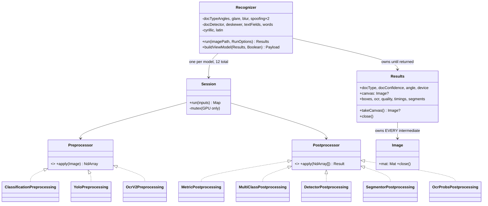

# ports/java — how this implementation works

The Kotlin/JVM port of `document_processing` and the reference service over it. Fourth of four
(Python is the reference; Go, .NET and this one are ports), and verified the same way as the others:
**44/44 conformance stages on all seven cases with zero skips, on both the cpu and gpu profiles**,
plus all seven `service/seed_data` documents recognised through the running HTTP service with
identical output to what the Python service recorded.

This file is for two readers: somebody integrating the library, and the next person (or model) who
opens this code with no memory of how it got here. It does **not** repeat the three normative
documents, which answer different questions:

| Document | Answers |
|---|---|
| `../CONVENTIONS.md` | how to write a port — the rules all four share |
| `../MAPPING.md` | which file corresponds to which, in all four languages |
| `DEVIATIONS.md` | where this port legitimately differs, `J-01`..`J-16` |
| **this file** | how *this* implementation actually works |

Two facts to have in mind before reading the code:

- **The JVM pins ONNX Runtime 1.21.1 — the reference's exact version.** Neither Go nor .NET can:
  neither publishes an artefact at that patch. This is the only port whose inference library is
  bit-for-bit the reference's.
- **OpenCV is built from source, and 4.13.0 is mandatory.** There is no official `org.opencv` on
  Maven Central at all, and contour approximation changed in 4.8 — the goldens encode 4.13
  behaviour, so a port on 4.9 fails `borders.segments` for a reason nothing in the code explains.

---

## 1. The two modules, and why the boundary is enforced

```
ports/java/
  docproc/     the library     — no dependency on :service, ever
  conform/     the CLI         — depends on :docproc
  service/     the HTTP service — depends on :docproc, and reaches it only through ml/
```

`:docproc` must never depend on `:service`, and `:service` must reach the library **only** through
`ml/PipelineRuntime.kt`. That is rule 10 of the reference's `service/ml/runtime.py` ("only this
module imports `document_processing`") turned into a build fact, and it is what lets every other part
of the service be tested without 215 MB of models — the 30 contract tests construct the runtime and
never initialise it.

```
docproc/src/main/kotlin/net/russiandocs/docproc/
  NativeLibraries.kt        the two Windows loading traps, and the one that has no code fix
  tensors/                  NdArray, PyNum, Npy, Ops      — no OpenCV, no ONNX
  imaging/                  Image, Io, Contours, Geometry — the ONLY package that touches OpenCV
  config/                   ModelPaths, Alphabets
  models/                   ModelJson, Loader, SegmentationModel, DetectionModel
  inference/                Session, DeviceResolution     — the ONLY package that touches ORT
  preprocess/               Preprocess, Yolo, OcrV2
  postprocess/              Postprocess, Detector, Segmentor, OcrProbs
  modules/                  one file per pipeline module
  pipeline/                 Recognizer, StageSink, Parallel, OcrOptions, SplitWords, Ocr, Timings
  viewmodel/                Labels, Payload, Builder      — D-01: on the LIBRARY side

service/src/main/kotlin/net/russiandocs/service/
  errors/     the seven error kinds, mapped to seven status codes in exactly one place
  config/     Settings — the environment tier, hand-written, no @ConfigurationProperties
  model/      Document, ApiKey, Timestamps
  store/      DocumentStore (the SQL swap point) + FileStore
  repositories/  Documents, ApiKeys, Artifacts, SettingsRepository
  settings/   SettingsSchema — the server-owned schema the UI renders itself from
  auth/       Tokens — hand-rolled HS256, no Spring Security
  logging/    LogRing — the ring buffer behind GET /logs, plus the stdout writer
  ml/         PipelineRuntime — THE DELIVERABLE. Ten numbered rules.
  worker/     RecognitionWorker, SearchText
  api/        ApiErrors, Identity, SysInfo, ApiServer, ApiDocuments, ApiMisc, ApiRoutes
  seed/       SeedData — reads the SAME service/seed_data as the Python service
  Application.kt   the entry point; builds every collaborator by hand, in order
```

`viewmodel` lives on the library side rather than in the service (`D-01`, and unlike Python's
`service/ml/transform.py`), because the conformance CLI must emit it without an HTTP layer existing.

**Spring MVC carries requests and nothing else** (`J-12`). No Spring Security, no Jackson for the wire
format, no `@RequestParam` for validated parameters, no `@ConfigurationProperties`. Each omission is
load-bearing, not taste — the reasons are in `DEVIATIONS.md`, and the shortest is that
`@RequestParam(defaultValue=…) Int` answers a Spring-shaped 400 where the published contract requires
a pydantic-shaped 422 whose `detail` is a LIST.

---

## 2. Types and ownership



Three ownership rules, and every one of them is a defect somebody already paid for:

1. **`Image` is `AutoCloseable` because `org.opencv.core.Mat` is not garbage-collected memory.** A Mat
   holds pixels outside the Java heap; the JVM sees a small object and feels no pressure to collect
   it. Python's GC hid this completely, which is why the reference has no equivalent discipline to
   copy.
2. **`Results` owns EVERY intermediate, not only the canvas.** The Go port's leak was exactly this:
   reading the canvas field and returning left the decoded original and a dozen intermediates alive,
   663 MB → 4018 MB across 230 documents, growing without bound. Nothing in the conformance suite
   could catch it — the CLI runs one document per process.
3. **`takeCanvas()` is how the one image that must outlive a run escapes.** It transfers ownership;
   `close()` then releases everything else. A bare field read is the leak in (2).

The postprocessor return type is a **closed set** of result classes with **one** checked cast, at the
module layer, which is the only place that knows what it asked for. Not a generic `Model<T>`: the
concrete type is unknown until `model.json` is read, so all four languages would end up at a runtime
cast anyway, and Kotlin's variance would make the generic version ugly in a third distinct way.

---

## 3. One recognition, end to end

```mermaid
sequenceDiagram
    participant C as caller
    participant R as Recognizer
    participant P as Parallel
    participant S as Session×12

    C->>R: run(path, options)
    R->>R: prepare — decode, BGR→RGB, fitToLongestSide (PyNum.floorDiv!)
    R->>S: DocTypeAngles → embeddings + angle
    R->>R: metric head: 1−cos, argmin, per-class radius
    alt docType == NONE
        R-->>C: Results (short return, NOT an error)
    end
    R->>R: rotate by angle×90
    alt lowQuality
        R->>P: launch 5: glare, blur, print, lcd, borders
        P-->>R: collect BY INDEX, in source order
    else
        R->>S: quality group sequentially, then borders
    end
    R->>R: extractQuad → convexHull(clockwise=false!) → four-point warp
    R->>R: deskew: Otsu, coarse 21 + fine scan, two-pass variance
    R->>S: TextFields → per-class NMS
    R->>P: splitWords — one Words call per field
    R->>S: OCR per word: cyrillic or latin by field, parity for SNILS
    R->>R: greedy CTC + alphabet masking (−inf, not zeroing)
    R->>R: join, dedup doubled Licence_number
    R-->>C: Results (caller closes; canvas via takeCanvas)
```

Branch points worth knowing before changing anything:

- **`docType == "NONE"` is a normal short return with a filled `Results`, not an error.** Throwing
  here breaks the "document not recognised" path the SPA renders as a legitimate state.
- **The quality/borders group is parallel only when `lowQuality` is set.** Otherwise the verdict must
  be known before deciding whether to run border detection at all — the reference's own reason.
- **`'intpassportaddr'` is checked before `'intpassport'`.** Substring order is load-bearing;
  reversing it routes the address page down the standard field path.
- **SNILS routes words to an engine by word-index PARITY, not field semantics.** Its dates read
  "26 СЕНТЯБРЯ 1997", so odd-indexed words go to the Cyrillic engine even inside a date field. It
  looks like a bug and is the behaviour the goldens encode.

---

## 4. Concurrency: five mechanisms, each with a measurement behind it

| Where | Mechanism | Why this one |
|---|---|---|
| The quality + borders group | `ExecutorService` + `Future`, launched in source order, collected **by index** | Positional collection is a CORRECTNESS requirement, not style: collecting as results arrive reorders boxes, words and the joined field string under load. `J-17` — an executor rather than coroutines, because the work is blocking native calls and `Dispatchers.IO` would add a scheduler with nothing to schedule. |
| Word splitting | The same primitive, one task per field | Same shape, same reason. |
| A GPU `Session` | A mutex held **only around `run()`** | 8 threads × 300 calls on one CUDA session: **6.59 s with the mutex, over 600 s without** and never finished. The Go port measured the same thing; Python saw it as `cudaErrorIllegalAddress`. Held only around the call, so five different models keep their parallelism. |
| A CPU `Session` | No lock at all | Deliberate: locking would serialise the parallel group and cost the speedup it exists for. |
| The pipeline pool | `Semaphore(1)` + `ArrayBlockingQueue`, entered only through `use { }` | A semaphore because the lease needs a TIMEOUT, which `synchronized` cannot express. The higher-order function makes "transform the result before releasing" **structural** instead of a comment somebody deletes. |

The soak that justifies all of it: **460 documents through the 8-thread group, RSS 288 → 1260 → 1135
→ 1220 → 1227 MB, zero failures.** A plateau, not a leak.

---

## 5. Resource lifetime — where a passing port dies at document 500

The conformance harness **cannot** see a leak: one document per process. So this section is the part
the green checkmark does not cover.

- Every `Image` is closed, and `Results.close()` is what closes the ones a run allocated.
- `Results` is used as `.use { }` in the service, so an exception cannot skip it.
- The canvas leaves through `takeCanvas()` and is then the **caller's** to close — the worker does it
  with `.use`, including on the failure paths.
- **The abandoned-work reaper matters more than it looks.** A timeout cannot cancel work already
  inside the library: `Future.cancel(true)` sets an interrupt flag that native ONNX code never checks.
  So the job fails, the loop moves on, and a second thread waits for the abandoned work purely to
  close the canvas it will still produce. Without that, every timed-out document holds a full canvas
  until a finalizer runs — which shows up only in bulk and looks like a slow leak rather than a
  timeout.
- The pipeline lease is released in a `finally`, so an exception in the body cannot wedge the pool at
  zero available — which would look exactly like the hang the lease timeout exists to report.

---

## 6. Errors, and what each means to a caller

`D-02` is accepted and documented: Go returns `(T, error)`, Kotlin and C# throw. The **taxonomy** is
what must not change — seven kinds, mapped to seven status codes in exactly one place
(`api/ApiErrors.kt`), so a handler never picks a status code.

| Kind | Status | Transient | Means |
|---|---|---|---|
| `PIPELINE_BUSY` | 503 | yes | No pipeline came free within the lease timeout. Requeued. |
| `RUNTIME_NOT_READY` | 503 | yes | Models still loading, or failed to load. Requeued. |
| `IMAGE_UNREADABLE` | 422 | **no** | The bytes did not decode. Retrying identical bytes is pointless. |
| `NOT_FOUND` | 404 | no | |
| `UNAUTHORIZED` | **401** | no | 401, not 403: the SPA redirects to the PIN screen on 401 only. |
| `CONFLICT` | 409 | no | Well-formed and allowed; the STATE forbids it. |
| `BAD_REQUEST` | 400 | no | |

**An UNKNOWN error counts as NON-transient**, and that default is the safe direction: an unrecognised
error retried forever stops the queue and leaves nothing in the log explaining why.

Two wire details that are client dependencies rather than choices: the body is
`{"detail": "<string>"}` everywhere **except** a query-parameter rejection, where the reference's own
shape is pydantic's list — reproduced deliberately, because a client parses what the server actually
sends. And a rejected SETTING is 400, not 422, because the reference raises `HTTPException(400)`
there.

---

## 7. Numeric fidelity — the traps that actually bit

Everything here is a silent failure of exact comparison. There is nowhere for it to hide behind a
tolerance.

| Trap | The Kotlin form |
|---|---|
| CPython float `//` is **not** `floor(x/y)` — it goes through `fmod` | `PyNum.floorDiv`. Found by a unit test: 2999×1777 gives width **1499** in Python and 1500 from `Math.floor`, and the canvas is then a pixel different, which moves every box. |
| `np.round` is **half to EVEN** | `Math.rint`, never `Math.round` or `roundToInt`. A different integer coordinate is a different crop is a different string. |
| `np.argmax` returns the **first** maximum | strict `>` only. On a tie, `>=` flips a CTC timestep and changes a character. |
| Stable sorts everywhere | `sortedBy`/`sortedWith` are stable (as LINQ's `OrderBy` is, and `sort.Slice` is not). Two equal-x word boxes swapping reorders two tokens in the joined field. |
| Python slices CLAMP; `Mat.submat` THROWS | `Crop.clampedCrop` is the only sanctioned crop path, with a unit test. |
| OpenCV default arguments | `convexHull(clockwise=false)`. This one cost M4: `true` changed which vertices Douglas-Peucker kept, one page came out 499 px instead of 505, and since that spread stitches vertically the canvas was 6 px narrow at exactly the right height. |
| float32 is never widened | `exp(x.toDouble()).toFloat()` element-wise (`D-05`), because JVM `Math.exp` promotes. |
| Locale | `Locale.ROOT` on every format. A ru-RU JVM writes `0,904` into the wire otherwise. |
| CTC masking uses `-inf`, not zeroing | Zeroing a column lets blank win and silently deletes a character. |

---

## 8. What is deliberately absent

- **INTPASSPORTADDR.** Not a code gap: there is no ANONYMISED sample, so the path has no golden and
  cannot be evaluated. The view model's address types are declared and unused on purpose — an omitted
  type reads as an oversight the next port "helpfully" invents differently.
- **`ocrGpuBatch`.** A documented 5–14 % field divergence in the reference; it would have to be
  re-measured from scratch here.
- **OpenVINO and CoreML runtimes.** The `Session` interface leaves them addable; there are no
  implementations.
- **A SQL store.** `DocumentStore` is the swap point and `FileStore` is the only implementation.
- **The whole FMS path.** `_fix_fms` is a `return` in the reference, its `difflib` search is dead, and
  the 1.6 MB CSV is parsed at import and never queried. Only the stub is ported, with the reason.

---

## 9. Consciously different from Python

| Python | Here | Why |
|---|---|---|
| `ThreadPoolExecutor` | `ExecutorService`, launched in source order, collected by index | `J-17`. Coroutines would add a scheduler for blocking native calls. |
| `@contextmanager lease_pipeline()` | `runtime.use(timeout) { }` | Makes "transform inside the lease" structural. |
| Exceptions everywhere | Exceptions, seven kinds, one mapping | `D-02`; Go returns errors. |
| `match` falling through to `None` | An unknown `model.json` tag raises, naming the tag | `D-06`. The reference turns a typo into a null dereference three stages later. |
| GC hides image lifetime | `AutoCloseable` everywhere, `takeCanvas()` for the one exception | A Mat is not heap memory. |
| `print()` to stdout | `LogRing`, two sinks, UTF-8 forced | `J-10`, `J-11`. `System.out` is not UTF-8 on Windows, so Cyrillic became `?`. |
| pydantic-settings | Hand-written `Settings.load` collecting ALL errors | Keeps each default beside its field, and the Go port reads it line for line. |
| FastAPI `Depends` | `guard(request, response, auth::requireX) { }` | The routing table reads as a permission list; `J-12`. |
| One image, CPU and GPU | Two Docker targets, ONE jar | The GPU artefact's CUDA kernels are ~4 GB a CPU host will never execute. The device logic is identical in both. |

---

## 10. Running it

Windows needs two things set, and both exist for reasons no error message explains — `J-01` for
OpenCV, `J-16` for ONNX Runtime. Neither can occur on Linux or in Docker.

```bash
# OpenCV, once (10-25 minutes). The cmake line is kept identical to the Docker stage's.
tools/build-opencv.sh ~/opencv-build
export RDOCS_OPENCV_HOME=~/opencv-build/build
export RDOCS_TOOLCHAIN_BIN=/c/msys64/mingw64/bin   # Windows only

# build and test — 10 docproc tests, 30 service contract tests
./gradlew build

# conformance, both profiles
python -m conformance.runner run --port java
python -m conformance.runner run --port java --profile gpu --device gpu

# the leak check the conformance harness structurally cannot do
java -jar conform/build/dist/rdocs-conform.jar soak --rounds 4 --threads 8

# the service
java -jar service/build/dist/rdocs-service.jar --addr :8005
```

**On Windows, ONNX Runtime will not load under a JDK whose bundled C runtime is older than the
system's** — see `J-16`. Use a current Temurin/Zulu/Corretto 21, or a COPY of the JDK with
`msvcp140.dll`, `vcruntime140.dll` and `vcruntime140_1.dll` replaced from `System32`. Preloading them
by absolute path does **not** work; it was measured, because it is the obvious thing to try.

**Both Docker targets have been built and run** (2026-08-07): `cpu` **2.01 GB**, `gpu` **7.21 GB** —
measured, not estimated. The GPU image was verified against a real card: twelve sessions in 3235 ms,
`device=gpu ocr_device=cpu`, a driver's licence recognised in 541 ms, running as `uid=10001(rdocs)`.

The first build failed, and the reason is worth keeping: OpenCV generates its Java bindings with a
Python script, so **without `python3` in the builder stage cmake reports `Java: NO` and simply omits
them** — no error, and the failure surfaces much later as a missing class. The Dockerfile's own
assertion caught it; that assertion is why the file checks for the bindings instead of trusting the
build.
